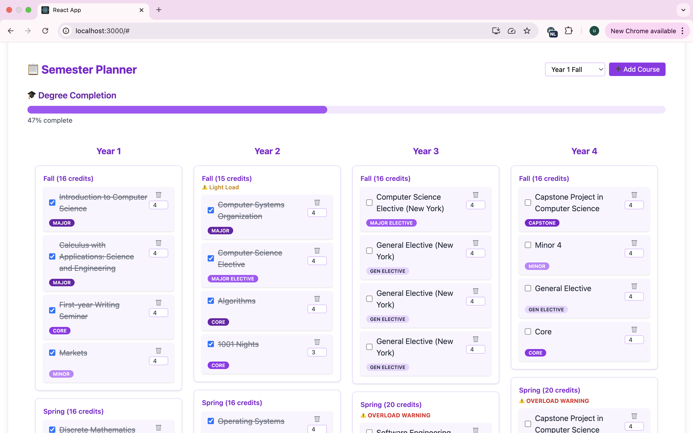
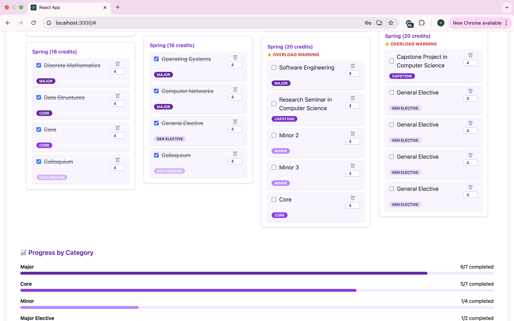
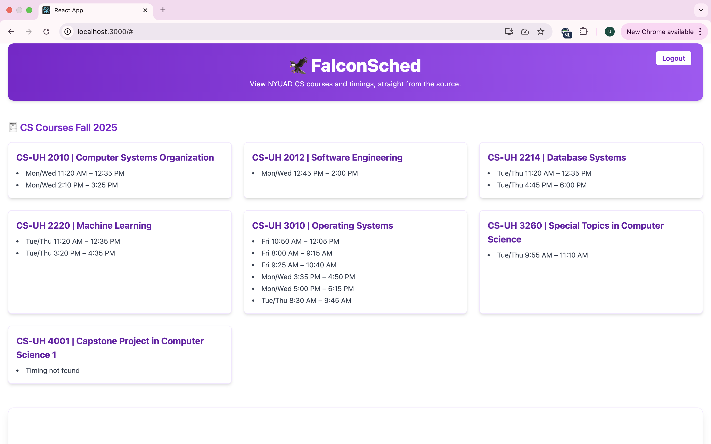
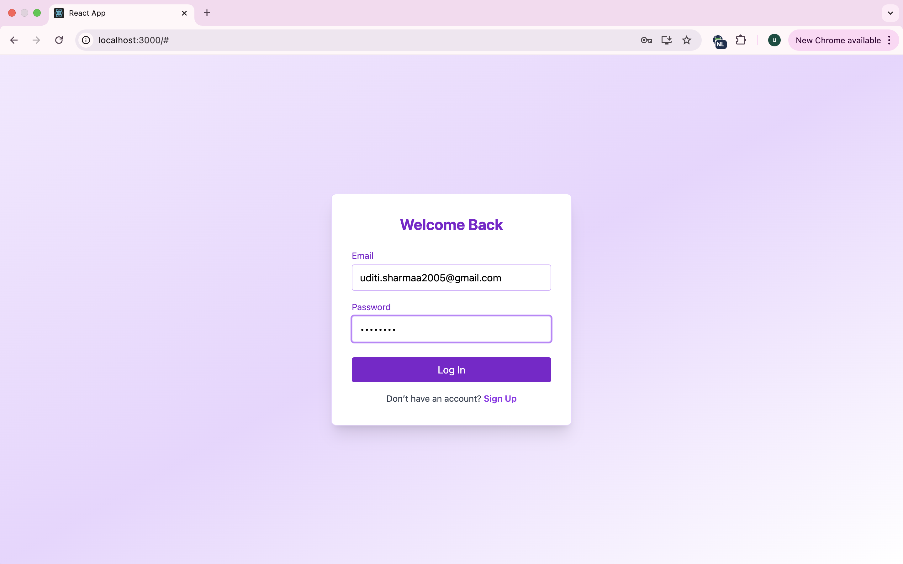

# 🦅 FalconSched — Your Personalized NYUAD CS Degree Planner




FalconSched is a full-stack academic planning web app built for NYU Abu Dhabi CS students to visually organize, track, and plan their entire 4-year journey — semester by semester.

It provides a clean drag-and-drop interface, credit tracking, course type tagging, progress visualization, and Supabase-powered user login and cloud saving.

---

## 🚀 Features

### 🎓 Visual Degree Planner
- Drag and drop interface to arrange courses across semesters
- Color-coded tags for Core, Major Electives, Minors, Colloquium, General Electives, and Capstone
- Credit counter per semester with overload/light-load warnings

### 📦 Course Customization
- Inline editing of course titles and credit numbers
- Tag selector to categorize courses by type
- Completion checkboxes for each course

### 📊 Smart Progress Tracking
- Degree completion bar based on completed courses
- Dynamic progress breakdown by course type (Core, Minor, Major Elective, etc.)
- Intelligent retagging of required CS courses (e.g. Intro to CS, Data Structures) as “Major” even if misclassified

### 🔍 Live CS Course Parsing (Albert ➜ JSON)
- **Automatically scrapes NYUAD's CS course listings from Albert's HTML export**
- Parses course titles and all offered **day/time sections**
- Converts them into clean JSON format for frontend use
- Uses **BeautifulSoup** and **regex** for robust formatting

> ✅ This ensures that FalconSched always displays the most up-to-date CS courses directly from the source — no hardcoded lists!

### ☁️ Supabase Integration
- User authentication (login/signup)
- Cloud saving of personalized degree plans per user
- Real-time sync between frontend and backend

### 🧾 Export to PDF
- One-click export of the full 4-year semester plan as a print-friendly PDF

---

## 🛠️ Technologies Used

| Area       | Stack & Tools                                                                 |
|------------|--------------------------------------------------------------------------------|
| **Frontend**  | React, Tailwind CSS, HTML5, JavaScript                                         |
| **Drag & Drop** | `@hello-pangea/dnd`                                                         |
| **PDF Export** | `html2canvas`, `jsPDF`                                                       |
| **Backend & Auth** | Supabase (PostgreSQL + Auth)                                              |
| **Course Scraper** | Python, BeautifulSoup, Regex (parses Albert HTML to structured JSON)     |
| **Utilities** | `uuid`, Axios, React Hooks                                                   |


## 📸 Screenshots






### ✅ Highlights:
- Scrapes and parses real data from NYU Albert
- Saves user data in the cloud with Supabase
- Handles editable + draggable components in React
- Tracks degree completion in real time
- Exports everything beautifully into a PDF

## 🧑‍💻 Getting Started

1. Clone the repo  
2. Run `npm install` in both `/frontend` and `/backend`  
3. Configure your `.env` with your Supabase credentials  
4. Run `npm run dev` in `/frontend`  
5. Run the backend parser (optional):  
   ```bash
   cd backend
   python parse_courses.py  # your HTML file must be named `csclassfall25.html`


